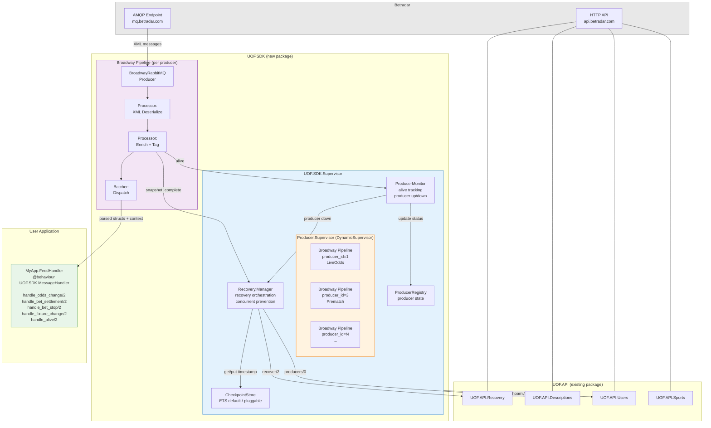

# UOF SDK — Betradar Unified Odds Feed SDK in Elixir

## Context

`uof_api` is a mature Elixir HTTP client for Betradar's UOF API (sports data, markets, recovery, booking). It has no AMQP code — the real-time feed (odds changes, bet settlements, alive heartbeats) arrives over RabbitMQ and is currently the consumer's responsibility. The goal is to build a new `uof_sdk` library that connects to the AMQP feed using Broadway + `BroadwayRabbitMQ`, depends on `uof_api` for HTTP calls (recovery, producer descriptions, whoami), and provides a turnkey experience similar to the official .NET/Java SDKs.

## Architecture

### Betradar Producers

Betradar has several producers, each publishing to its own AMQP exchange:
- **1 — Live Odds** (`liveodds`) — live match odds
- **3 — Prematch** (`pre`) — pre-match odds
- **4 — Live Betting Virtually** (`liveodds`) — virtual sports
- **5 — Premium Cricket** (`premiumcricket`)
- **6 — Virtual Football** (`vfl` / `vf`)
- **7 — Numbers Betting** etc.

Each producer sends `alive` heartbeats every ~10s. If no `alive` is received within `max_inactivity_seconds`, the producer should be marked as down and recovery initiated.

### Feed Message Types (from XSDs)

All arrive as XML over AMQP:
- `odds_change` — market odds updated
- `bet_stop` — suspend betting (danger state)
- `bet_settlement` — market results
- `bet_cancel` / `rollback_bet_cancel`
- `rollback_bet_settlement`
- `fixture_change` — fixture metadata changed
- `alive` — producer heartbeat
- `snapshot_complete` — end of recovery sequence

### Routing Keys

Format: `<priority>.<prematch|live|virt>.<message_type>.<sport_id>.<urn_type>.<event_id>.<node_id>`

Example: `hi.-.live.odds_change.1.sr:match.12345.-`

## Architecture Diagram



## Proposed Design

### 1. Separate Hex Package: `uof_sdk`

New project, depends on `uof_api` for HTTP. This keeps concerns clean — `uof_api` stays a pure HTTP client.

### 2. One Broadway Pipeline Per Producer

```elixir
# Each producer gets its own Broadway pipeline
UOF.SDK.Producer.LiveOdds      # producer_id: 1
UOF.SDK.Producer.Prematch      # producer_id: 3
UOF.SDK.Producer.Virtuals      # producer_id: 4
# etc.
```

**Why per-producer?**
- Isolation: a stalled/crashed producer doesn't affect others
- Independent recovery: each producer has its own recovery window and `alive` cycle
- Different `max_inactivity_seconds` per producer
- Matches the official SDK architecture (sessions per producer)

Each pipeline uses `BroadwayRabbitMQ.Producer` with:
- Connection to the Betradar AMQP endpoint (vhost from `UOF.API.Users.whoami()`)
- Queue binding to the producer's exchange with appropriate routing keys
- `concurrency` tuned per producer type (live needs more parallelism than prematch)

### 3. Message Processing Pipeline

```
AMQP → Broadway Producer → XML Deserializer → Message Router → User Callbacks
                                                    ↓
                                            Recovery Manager
                                            Producer Monitor
                                            Cache (optional)
```

**Broadway processors:**
1. **Deserialize** — parse XML to Ecto structs (reuse `UOF.API.XML` parser + generate feed schemas from `ext/UnifiedFeed.xsd`)
2. **Enrich** — attach producer metadata, timestamps, routing key info
3. **Dispatch** — route to user-defined handlers via behaviour callbacks

### 4. Core Modules

| Module | Responsibility |
|--------|---------------|
| `UOF.SDK` | Top-level supervisor, configuration, startup |
| `UOF.SDK.Producer` | Dynamic supervisor for Broadway pipelines |
| `UOF.SDK.Producer.Pipeline` | Generic Broadway module (parameterized per producer) |
| `UOF.SDK.ProducerMonitor` | Tracks `alive` heartbeats, detects producer down, triggers recovery |
| `UOF.SDK.Recovery` | Orchestrates recovery flow: calls `UOF.API.Recovery`, tracks `snapshot_complete`, prevents concurrent recoveries per producer |
| `UOF.SDK.CheckpointStore` | Behaviour for timestamp persistence; default ETS implementation included |
| `UOF.SDK.MessageHandler` | Behaviour that users implement |
| `UOF.SDK.Feed.Message` | Feed message schemas (generated from `ext/UnifiedFeed.xsd`) |

### 5. User-Facing API (Behaviour)

```elixir
defmodule MyApp.FeedHandler do
  @behaviour UOF.SDK.MessageHandler

  @impl true
  def handle_odds_change(odds_change, producer) do
    # process odds update
    :ok
  end

  @impl true
  def handle_bet_settlement(settlement, producer) do
    :ok
  end

  @impl true
  def handle_bet_stop(bet_stop, producer) do
    :ok
  end

  # ... other callbacks with default no-op implementations via __using__
end
```

### 6. Configuration

Configuration-driven producer selection — enable/disable producers without code changes:

```elixir
config :uof_sdk,
  handler: MyApp.FeedHandler,
  environment: :integration,       # :integration | :production
  producers: [
    live:     [enabled: true,  concurrency: 10],
    prematch: [enabled: true,  concurrency: 5],
    virtuals: [enabled: false],
    # Omitted producers default to disabled.
    # Unknown producer names are validated against UOF.API.Descriptions.producers()
  ],
  amqp: [
    host: "mq.betradar.com",
    port: 5671,
    ssl: true
  ]
  # auth_token and bookmaker info fetched via uof_api
```

At startup, the SDK fetches available producers from `UOF.API.Descriptions.producers/0`, cross-references with config, and starts Broadway pipelines only for `enabled: true` producers. This also validates that configured producer names actually exist. Per-producer options like `concurrency` allow tuning (live typically needs more parallelism than prematch).

### 7. Supervision Tree

```
UOF.SDK.Supervisor
├── UOF.SDK.ProducerRegistry          (ETS-backed producer state)
├── UOF.SDK.ProducerMonitor           (GenServer: alive tracking, recovery triggers)
├── UOF.SDK.Recovery.Manager          (GenServer: recovery orchestration)
├── UOF.SDK.Producer.Supervisor       (DynamicSupervisor)
│   ├── Broadway Pipeline (producer_id=1, LiveOdds)
│   ├── Broadway Pipeline (producer_id=3, Prematch)
│   └── ...
└── UOF.SDK.CheckpointStore.ETS       (default checkpoint persistence)
```

### 8. Feed Message Schemas

Extend the XSD code generation from `uof_api` to also generate feed message schemas from `ext/UnifiedFeed.xsd`. These are the AMQP message types (vs. the HTTP response types already generated). Key schemas:
- `UOF.SDK.Feed.OddsChange`
- `UOF.SDK.Feed.BetSettlement`
- `UOF.SDK.Feed.BetStop`
- `UOF.SDK.Feed.BetCancel`
- `UOF.SDK.Feed.FixtureChange`
- `UOF.SDK.Feed.Alive`
- `UOF.SDK.Feed.SnapshotComplete`

### 9. Recovery Flow

**State machine per producer:** `:down → :recovering → :up → (timeout) → :down`

**Concurrent recovery prevention:** The Recovery Manager GenServer maintains per-producer state (`%{producer_id => %{status, request_id, initiated_at}}`). New recovery requests are rejected while one is in-flight for that producer.

**Timestamp checkpointing:** Each successfully processed message updates a checkpoint timestamp. On recovery, the SDK uses `UOF.API.Recovery.recover(product, after: last_timestamp)` for incremental recovery instead of a full snapshot (when a checkpoint exists).

**Flow:**
1. On startup → check `CheckpointStore.get(producer_id)`:
   - If checkpoint exists → `recover(product, after: timestamp)` (incremental)
   - If no checkpoint → `recover(product)` (full snapshot)
2. On producer down (no `alive` for `max_inactivity_seconds`) → mark `:down`, initiate recovery from last checkpoint
3. During recovery → **all messages delivered to user callbacks** (both recovery and live). Producer status (`:recovering` / `:up`) is included in the context passed to callbacks so users can decide how to handle incomplete state.
4. On `snapshot_complete` with matching `request_id` → transition to `:up`, notify handler
5. Event-level recovery via `UOF.API.Recovery.recover_event/3` (independent of producer-level recovery)

**Message discrimination during recovery:** Recovery messages carry a `request_id` matching the in-flight recovery. Live messages don't. The processor tags each message accordingly but delivers both — recovery fills gaps, live messages keep state current.

### 10. Checkpoint Store

Pluggable persistence for recovery timestamps via behaviour:

```elixir
defmodule UOF.SDK.CheckpointStore do
  @callback get(producer_id :: integer()) :: {:ok, timestamp :: integer()} | :none
  @callback put(producer_id :: integer(), timestamp :: integer()) :: :ok
  @callback delete(producer_id :: integer()) :: :ok
end
```

Ships with `UOF.SDK.CheckpointStore.ETS` as the default — zero external dependencies, fast, lost on VM restart (falls back to full recovery, which is the expected cold-start path anyway). Users can implement the behaviour with PostgreSQL/Redis for faster recovery across restarts.

Configuration:
```elixir
config :uof_sdk,
  checkpoint_store: UOF.SDK.CheckpointStore.ETS  # default
  # or: checkpoint_store: MyApp.PostgresCheckpointStore
```

### 10. Dependencies

```elixir
defp deps do
  [
    {:uof_api, "~> 2.0"},
    {:broadway, "~> 1.1"},
    {:broadway_rabbitmq, "~> 0.8"},
    {:amqp, "~> 3.3"}
  ]
end
```

## Implementation Phases

**Phase 1 — Foundation:** New mix project, config, supervision tree, AMQP connection, Broadway pipeline skeleton with a single hardcoded producer.

**Phase 2 — Message parsing:** Generate feed schemas from XSD, XML deserialization in Broadway processor, message handler behaviour with callbacks.

**Phase 3 — Multi-producer:** Dynamic Broadway pipelines per configured producer, producer registry.

**Phase 4 — Producer monitoring & recovery:** Alive tracking, producer up/down state machine, automatic recovery orchestration.

**Phase 5 — Polish:** Telemetry events, logging, optional caching, documentation, tests.

## Key Decisions

- **Per-producer Broadway pipelines** — Yes, as you suggested. Isolation, independent recovery, and matching the official SDK pattern.
- **Reuse `UOF.API.XML` parser** — The existing XML→Ecto pipeline works well; feed messages use the same XSD-based structure.
- **Extend XSD codegen** — Generate feed message schemas from `ext/UnifiedFeed.xsd` using the same generator.
- **Broadway over bare GenServer/AMQP** — Broadway gives us backpressure, batching, fault tolerance, and telemetry for free.

## Verification

1. Connect to Betradar integration environment AMQP endpoint
2. Verify messages arrive and deserialize correctly for each producer
3. Kill a producer connection → verify recovery triggers automatically
4. Verify `snapshot_complete` transitions producer back to "up"
5. Run with multiple producers simultaneously
6. Unit test message parsing with XML fixtures (same pattern as `uof_api` tests)
